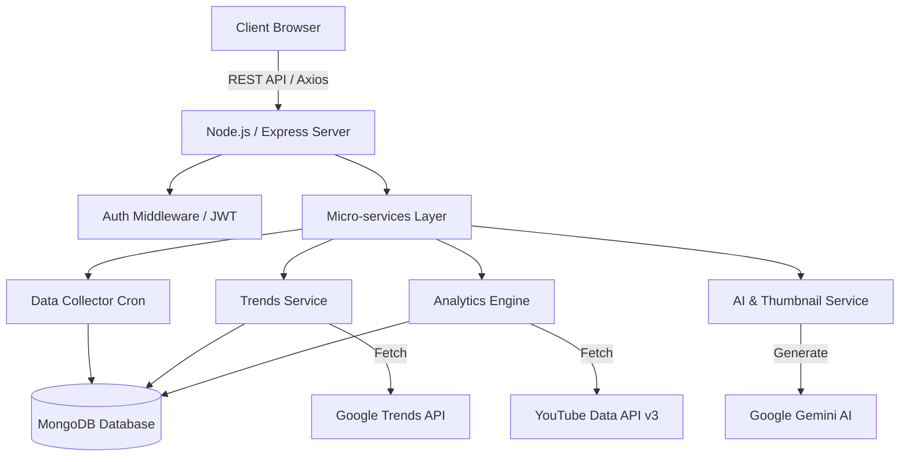
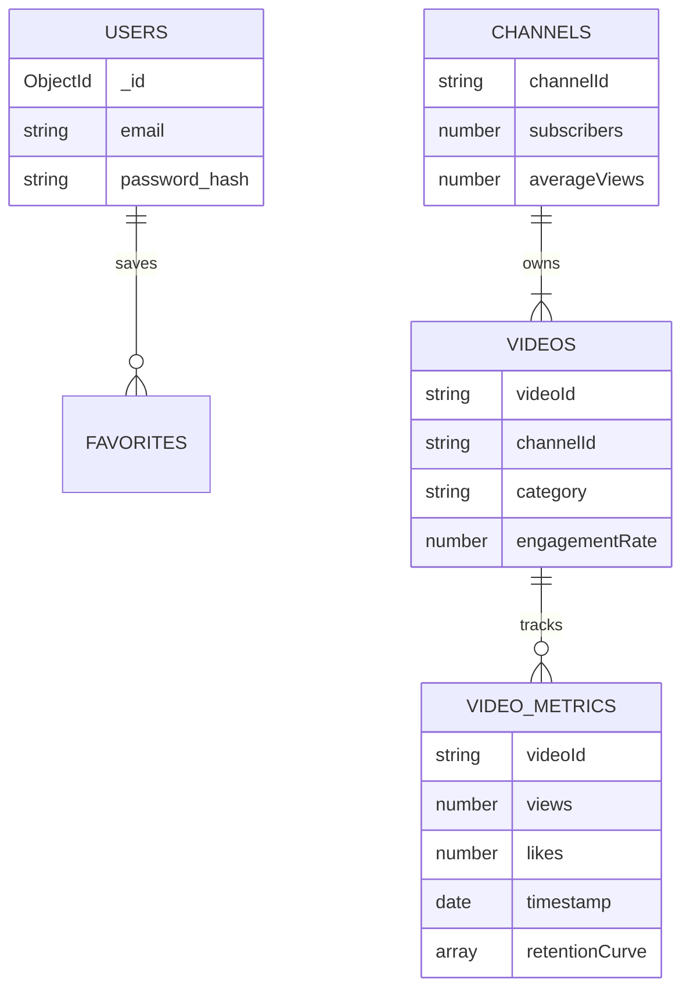

<div align="center">
  
  <h1>TrendTube</h1>

  **The AI-Powered Analytics & Growth Engine for YouTube Creators**

  [](https://github.com/magarishu/TrendTube)
  [](LICENSE)
  [](https://reactjs.org/)
  [](https://nodejs.org/)
  [](https://mongodb.com/)
  
  [**Explore Demo**](#) • [**API Documentation**](#8-api-integrations) • [**Report Bug**](#)
</div>

<br />

## 1. Overview
**TrendTube** is an enterprise-grade SaaS platform built for YouTube content creators, digital marketers, and media agencies. By leveraging real-time data from Google Trends, YouTube Data API, and Google's Gemini AI, TrendTube provides actionable insights to optimize content strategy, maximize audience retention, and significantly boost channel growth.

## 2. Why TrendTube Exists
YouTube creators face a highly competitive landscape where data-driven decisions are the difference between stagnation and virality. TrendTube solves critical creator pain points:
- **Blind Content Creation**: Eliminates guesswork by finding trending topics aligned with niche interests.
- **Engagement Drop-offs**: Visualizes audience retention to identify exactly where viewers lose interest.
- **Suboptimal Thumbnails/Titles**: Uses AI to predict and generate high-CTR thumbnails and viral titles.
- **Competitive Benchmarking**: Provides an outlier analysis system to understand competitor success.

## 3. Features
- 🧠 **AI-Powered Insights**: Get content recommendations, SEO scores, and viral potential predictions via Google Gemini AI.
- 📈 **Real-Time Trending Data**: Integrated Google Trends with location (11+ countries) and time-range filters.
- 📊 **Audience Retention Analysis**: Detailed 7-point retention curve visualization with percentile decay tracking.
- 💸 **Earnings Estimator**: Calculates estimated AdSense revenue based on niche, country CPMs, and real view counts.
- 🎯 **Outlier Detection**: Automatically flags videos performing significantly above their channel's average.
- 🖼️ **Smart Thumbnail Generator**: Create, customize, and evaluate high-converting thumbnails using AI.
- 🔐 **Secure Authentication**: Enterprise-ready JWT-based authentication system with persistent MongoDB sessions.

## 4. Screenshots

<div align="center">
  
  
  
  
  
  
  
  
  
  
  
  
  
  
  
</div>

## 5. Architecture



## 6. Tech Stack

| Layer | Technologies |
|-------|--------------|
| **Frontend** | React 18, TypeScript, Vite, TailwindCSS, shadcn/ui, Recharts, Framer Motion, React Query |
| **Backend** | Node.js 20+, Express.js, JWT, PM2 |
| **Database** | MongoDB (Mongoose ODM), Redis/Node-Cache |
| **Integrations** | Google Gemini AI API, YouTube Data API v3, Clerk Auth |
| **Testing** | Vitest, Playwright, Jest DOM |
| **DevOps** | ESLint, Vercel (Frontend), Render/AWS (Backend) |

## 7. Data Flow
TrendTube utilizes a **Cron-based Smart Data Collection Strategy** to prevent API quota exhaustion while maintaining fresh data:
1. **Periodic Aggregation**: Cron jobs fetch trending videos every hour, and specific regions every 3 hours.
2. **Metrics Refresh**: Existing video metrics update every 6 hours.
3. **Database-First Access**: Client queries hit MongoDB directly rather than third-party APIs.
4. **On-the-fly Computation**: Outlier scores, growth velocity, and retention percentiles are computed in real-time based on cached MongoDB time-series data.

## 8. API Integrations
- `Google Generative AI (Gemini)`: Powers the automated thumbnail generation, title optimization, and content insight extraction.
- `YouTube Data API v3`: Used to fetch initial metadata, channel stats, and baseline video performance.
- `Google Trends API`: Provides real-time and historical search interest, top queries, and rising keywords.

## 9. Database Design
Our MongoDB architecture is optimized for high-read throughput and time-series analysis.



## 10. Folder Structure

```text
trendtube/
├── frontend/
│   ├── src/
│   │   ├── components/    # Reusable shadcn/ui & feature components
│   │   ├── pages/         # Route pages (Dashboard, VideoAnalyzer, etc.)
│   │   ├── hooks/         # Custom React hooks (useAuth, useFavorites)
│   │   └── lib/           # Utility functions (Tailwind merge, etc.)
│   ├── public/            # Static assets
│   └── package.json       # Frontend dependencies (Vite)
└── backend/
    ├── controllers/       # Route request handlers
    ├── models/            # Mongoose schemas
    ├── routes/            # Express API routes
    ├── services/          # Business logic (Analytics, Trends, AI)
    ├── middleware/        # JWT Auth, Rate limiting, Error Handling
    ├── scripts/           # Cron jobs & Database seeders
    └── server.js          # Express entry point
```

## 11. Installation

```bash
# 1. Clone the repository
git clone https://github.com/magarishu/TrendTube.git
cd TrendTube

# 2. Setup Backend
cd backend
npm install
# Create .env file based on .env.example
npm run dev

# 3. Setup Frontend
cd ../frontend
npm install
# Create .env file
npm run dev
```

## 12. Environment Variables

**Backend (`backend/.env`)**
```env
PORT=5000
MONGODB_URI=mongodb+srv://<user>:<password>@cluster.mongodb.net/trendtube
JWT_SECRET=your_super_secret_key_here
GOOGLE_API_KEY=your_gemini_api_key
YOUTUBE_API_KEY=your_youtube_api_key
NODE_ENV=development
```

**Frontend (`frontend/.env`)**
```env
VITE_API_URL=http://localhost:5000/api
VITE_CLERK_PUBLISHABLE_KEY=your_clerk_publishable_key
```

## 13. Deployment
- **Frontend**: Ready for Vercel or Netlify. Contains `vercel.json` and `netlify.toml` configurations.
- **Backend**: Configured with PM2 (`ecosystem.config.cjs`) for production stability. Deployable on Render, Railway, or AWS EC2.

## 14. Future Roadmap
- [ ] **WebSockets**: Transition from HTTP polling to WebSockets for real-time dashboard updates.
- [ ] **Advanced A/B Testing**: In-app A/B testing simulator for thumbnails and titles.
- [ ] **Email Reports**: Automated weekly growth reports via Nodemailer.
- [ ] **Multi-Platform**: Expand analytics support to TikTok and Instagram Reels.

## 15. Performance Optimizations
- **Smart Data Caching**: Prevents excessive API calls using `node-cache`.
- **Route-based Code Splitting**: Minimizes initial bundle size (<250KB gzipped).
- **Time-Series Metric Tracking**: Efficient tracking using MongoDB document schemas tailored for chronological data.
- **Debounced Inputs**: Eliminates unnecessary API load during user search actions.

## 16. Security Features
- **Auth**: Secure JWT implementation with HttpOnly storage and robust bcrypt password hashing (10 rounds).
- **API Protection**: `helmet` for secure HTTP headers, `cors` configured for specific origins, and `express-rate-limit` to prevent DDoS.
- **Database Safety**: Protection against NoSQL injection via strict Mongoose schema validation.

## 17. Contributing
We welcome contributions! Please follow these steps:
1. Fork the repository.
2. Create a feature branch: `git checkout -b feature/amazing-feature`
3. Commit your changes: `git commit -m 'Add amazing feature'`
4. Push to the branch: `git push origin feature/amazing-feature`
5. Open a Pull Request.

## 18. License
This project is licensed under the MIT License - see the [LICENSE](LICENSE) file for details.

---

<div align="center">
  Built with ❤️ by <a href="https://github.com/magarishu">magarishu</a>
</div>
